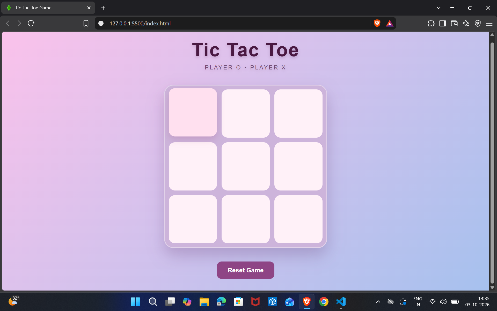
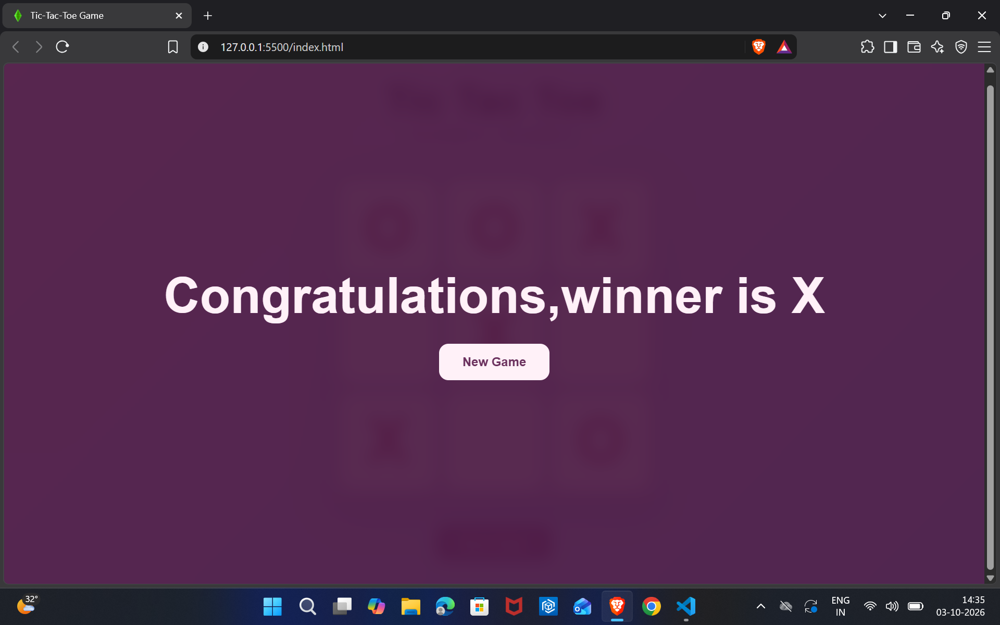
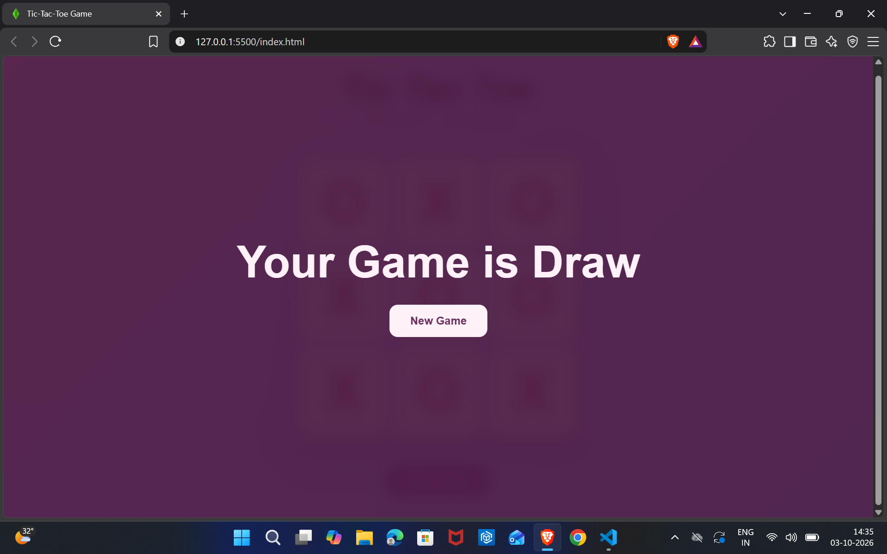

#  Tic Tac Toe Game

A simple and interactive **Tic Tac Toe game** built using **HTML, CSS, and JavaScript**.
This project focuses on implementing game logic, DOM manipulation, event handling, and a clean user interface.

##  Features

*  Two-player gameplay
*  Automatic winner detection
*  Draw detection
*  Restart / reset game
*  Interactive game board
*  Responsive design
*  Clean and modern UI

##  Technologies Used

| Technology     | Purpose                         |
| -------------- | ------------------------------- |
| **HTML5**      | Structure of the game           |
| **CSS3**       | Styling and responsive UI       |
| **JavaScript** | Game logic and DOM manipulation |

##  How to Play

1. Player **X** starts the game.
2. Players take turns clicking an empty cell.
3. The first player to get **three marks in a row,    column, or diagonal** wins.
4. If all cells are filled without a winner, the game ends in a **draw**.
5. Click the **Reset Game** button to play again.

##  Project Structure

```text
tic-tac-toe/
│
├── index.html      # Game structure
├── style.css       # Game styling
├── script.js       # Game logic
└── README.md       # Project documentation
```

##  What I Learned

While building this project, I practiced:

* HTML page structure
* CSS styling and layouts
* JavaScript variables and functions
* DOM manipulation
* Event listeners
* Conditional statements
* Arrays
* Game-state management
* Handling user interactions

## Run Locally

Clone the repository:

```bash
git clone https://github.com/kumarbysani2007/tic-tac-toe.git
```

Navigate to the project:

```bash
cd tic-tac-toe
```

Then open `index.html` in your browser.

No additional dependencies or installations are required.

##  Preview

## Screenshots

### Game Interface



### Winning State



### Draw State




##  Future Improvements

Some features that can be added in the future:

*  Player vs Computer mode
*  Score tracking
*  Sound effects
*  Dark mode
*  Difficulty levels
*  Improved animations

##  Author

**Kumar Bysani**

GitHub: [@kumarbysani2007](https://github.com/kumarbysani2007)

---

If you like this project, consider giving the repository a star!
